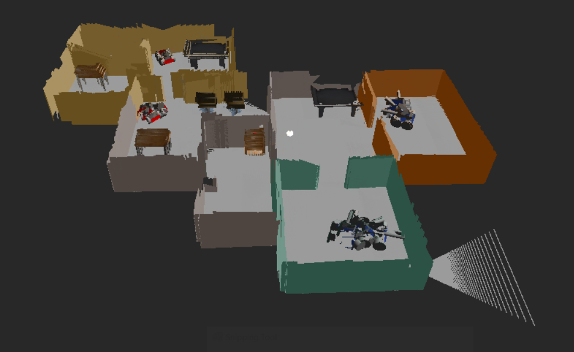
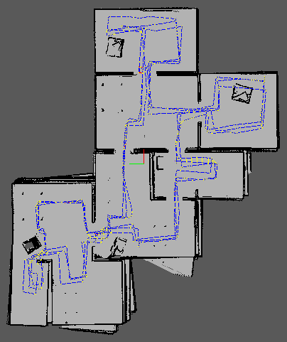
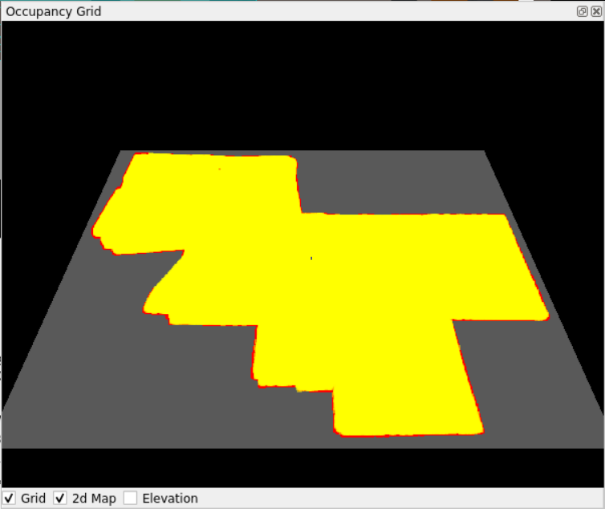
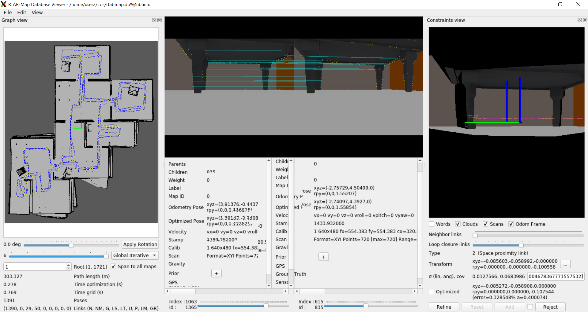

# Map My World

Map my world is a project that create a 2D occupancy grid and 3D octomap from simulated environment in Gazebo with [RTAB-Map package](http://wiki.ros.org/rtabmap_ros). With this package, mobile robot can map environments in 3D.

This project is part of course 5 in Udacity Robotics Software Engineer Nanodegree.

<table style="width:100%">
  <tr>
    <th><p>
           </a>
           <br>3D Map
        </p>
    </th>
    <th><p>
           </a>
           <br>2D Map
      </p>
    </th>
  </tr>
  <tr>
    <th><p>
           </a>
           <br>Occupancy Grid
      </p>
    </th>
    <th><p>
           </a>
           <br>Database Overview
      </p>
    </th>
  </tr>
</table>

## Project Info
The robot uses an RGB-D camaera and Lidar sensor to localize and create 3D map of the environment. Tested on Ubuntu 20.04.
The project consists of following parts:
1. A Gazebo world and a mobile robot employs with an RGB-D camera.
2. ROS package: [rtabmap-ros](http://wiki.ros.org/rtabmap_ros)
3. Database analysis file consist of 3D environment data, loop closure, etc.

## Prerequisites
1. Linux (Ubuntu 20.04)
2. ROS (Noetic) packages
3. Gazebo
4. RTAB-MAP package

## How to build
1. Initialize a catkin workspace and clone this project to catkin src directory
```
$ mkdir -p catkin_ws/src
$ cd catkin_ws/src
$ catkin_init_workspace
$ git clone https://github.com/yeetengang/Robotics-MapMyWorld.git
```

2. Clone ROS teleop node (teleop_twist_keyboard) into src directory
```
$ git clone https://github.com/ros-teleop/teleop_twist_keyboard
```

3. Build
```
$ cd ..
$ catkin_make
```

4. Launch world file
```
$ source devel/setup.bash
$ roslaunch my_robot world.launch
```

5. Open another terminal tab, launch the teleop node
```
$ source devel/setup.bash
$ rosrun teleop_twist_keyboard teleop_twist_keyboard.py
```

6. Open another terminal tab again, launch the mapping launch file.
```
$ source devel/setup.bash
$ roslaunch my_robot mapping.
```

7. Navigate the robot movement via teleop node. To ensure proper environment data collected, you will need to navigate around the map for a few loops. 

8. After navigation, terminate the mapping.launch node and the rtabmap-ros package will save the resulted map with localized trajectory in a database file located in `~/.ros/rtabmap.db`

9. Open the `rtabmap-databaseViewer` tool to explore the database file generated. It allow complete analysis of your mapping session.
```
$ rtabmap-databaseViewer ~/.ros/rtabmap.db
```

10. Once open, choose 'yes' when asked about database parameters. Add some windows as below to get better view of information.
* Choose View -> Constraints View and Graph VIew
* To see 3D Map: Choose Edit -> View 3D Map

11. On left, a 2D grid map is shown. On bottom left there is `Links (N, NM, G, etc.)` information, where you can get the number of loop closure as `G`. 
In my case, I got 29 loop closure.

Google drive link to db file: https://drive.google.com/file/d/1TSntBp6hOOmeRXKYJGjA-vLSd7LNhHDO/view?usp=sharing
